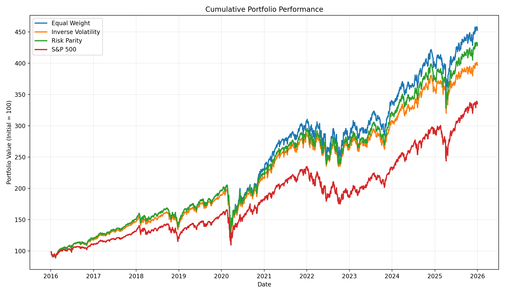
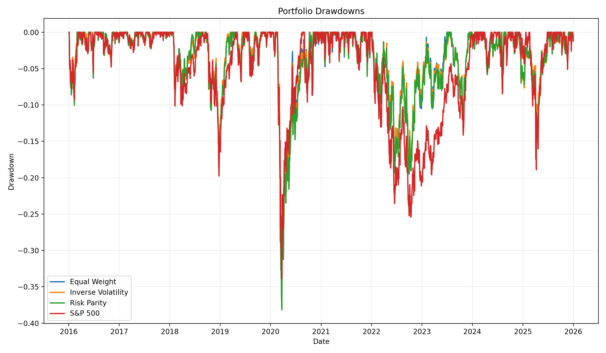
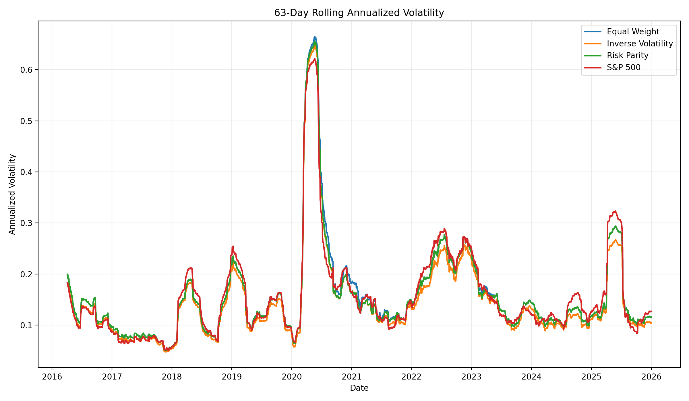
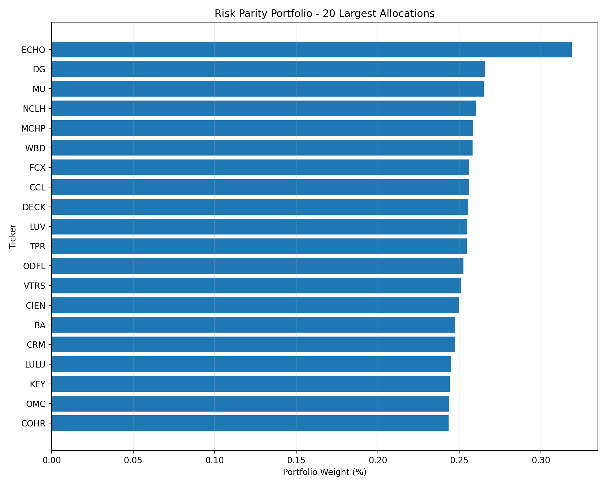

# Portfolio Backtesting Framework

A Python framework for backtesting and comparing systematic equity allocation strategies on a large-cap U.S. equity universe.

The project implements portfolio construction, rolling estimation, monthly rebalancing, turnover-based transaction costs, performance analytics, and visualization against the S&P 500 benchmark.

## Strategies

The framework compares three systematic allocation approaches:

### 1. Equal Weight

Each eligible stock receives the same target allocation:

$$w_i = \frac{1}{N}$$

This provides a simple diversification baseline independent of market capitalization or estimated risk.

### 2. Inverse Volatility

Portfolio weights are inversely proportional to each asset's historical volatility:

$$w_i \propto \frac{1}{\sigma_i}$$

Lower-volatility assets therefore receive larger allocations.

### 3. Risk Parity

The Risk Parity portfolio uses the historical covariance matrix and numerical optimization to target approximately equal contributions to total portfolio risk.

This differs from inverse-volatility weighting because it incorporates correlations between assets through the covariance matrix.

## Backtesting Methodology

- Historical period: **2015–2025**
- Investment universe: current S&P 500 constituents with sufficient historical price coverage
- Price data: Yahoo Finance via `yfinance`
- Minimum price-data coverage: **95%**
- Estimation window: **252 trading days**
- Rebalancing frequency: **monthly**
- Transaction-cost assumption: **10 bps × portfolio turnover**
- Portfolio constraints: **long-only, fully invested**
- Benchmark: **S&P 500 Index**
- Initial portfolio value: **100**

At each rebalance, strategy weights are estimated using only observations preceding the rebalance date. Between rebalances, portfolio weights are allowed to drift with asset returns.

## Performance Summary

| Strategy | Annualized Return | Annualized Volatility | Sharpe Ratio | Maximum Drawdown |
|---|---:|---:|---:|---:|
| Equal Weight | 16.34% | 18.37% | 0.89 | -38.16% |
| Inverse Volatility | 14.82% | 17.30% | 0.86 | -37.51% |
| Risk Parity | 15.69% | 18.12% | 0.87 | -38.16% |
| S&P 500 | 12.88% | 18.13% | 0.71 | -33.92% |

The reported Sharpe ratios currently use a **0% risk-free-rate assumption**.

These results should be interpreted as a demonstration of the backtesting framework rather than evidence of investable outperformance. See **Limitations** below.

## Cumulative Performance



## Drawdown Analysis



## Rolling Volatility

The chart below shows 63-trading-day rolling volatility, annualized using 252 trading days per year.



## Risk Parity Allocation

The following chart shows the 20 largest portfolio weights in the most recent Risk Parity allocation.



## Performance Analytics

The framework calculates:

- Compound annualized return
- Annualized volatility
- Sharpe ratio
- Maximum drawdown
- Rolling volatility
- Portfolio turnover
- Cumulative wealth

## Project Structure

```text
portfolio-backtesting-framework/
│
├── src/
│   ├── data.py
│   ├── strategies.py
│   ├── backtest.py
│   ├── analytics.py
│   └── visualization.py
│
├── results/
│   ├── performance_summary.csv
│   ├── strategy_returns.csv
│   ├── cumulative_performance.png
│   ├── drawdowns.png
│   ├── rolling_volatility.png
│   └── risk_parity_allocations.png
│
├── README.md
├── requirements.txt
└── .gitignore
```

### `data.py`

Handles:

- S&P 500 constituent retrieval
- Historical price downloads
- Data-quality filtering
- Missing observations
- Daily return calculation
- Benchmark retrieval

### `strategies.py`

Implements:

- Equal Weight
- Inverse Volatility
- Risk Parity / Equal Risk Contribution optimization

### `backtest.py`

Implements:

- Rolling 252-day estimation
- Monthly portfolio rebalancing
- Natural weight drift between rebalances
- Portfolio turnover
- Transaction costs
- Strategy execution
- Result export

### `analytics.py`

Calculates portfolio performance and risk metrics.

### `visualization.py`

Generates performance and risk charts from the backtest outputs.

## Installation

Clone the repository and create a Python environment.

```bash
python -m venv .venv
source .venv/bin/activate
pip install -r requirements.txt
```

Run the backtest:

```bash
python src/backtest.py
```

Generate the charts:

```bash
python src/visualization.py
```

## Limitations

This project is designed primarily as a portfolio-construction and backtesting framework.

The historical backtest uses the **current S&P 500 constituent universe** rather than point-in-time historical membership. Consequently, the results are subject to **survivorship bias** and should not be interpreted as a clean historical test of strategy alpha.

Additional limitations include:

- Yahoo Finance is used as a research data source rather than an institutional market-data feed.
- Transaction costs are modeled using a simplified linear turnover assumption.
- Taxes, bid-ask dynamics, market impact, and liquidity constraints are not modeled.
- The current Sharpe-ratio calculation assumes a 0% risk-free rate.
- Corporate and index methodology effects are not reproduced in full.
- Risk estimates are based on a fixed 252-trading-day historical window.

A production-grade implementation would use point-in-time constituent data, institutional-quality pricing and corporate-action data, a time-varying risk-free rate, and more detailed execution-cost modeling.

## Potential Extensions

Future extensions include:

- Point-in-time S&P 500 membership
- Historical risk-free rates
- Alternative covariance estimators
- Volatility targeting
- Sector and position constraints
- Risk-contribution diagnostics
- Transaction-cost sensitivity analysis
- Market-regime analysis
- Walk-forward parameter testing

## Technologies

Python, pandas, NumPy, SciPy, Matplotlib, yfinance, Git